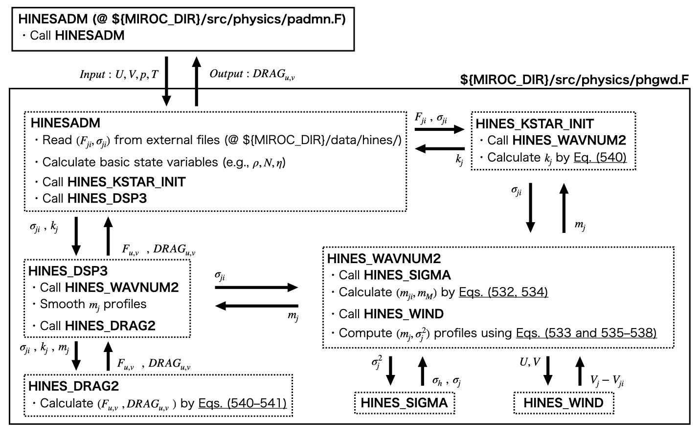

## Gravity Waves

Effects of sub-grid scale gravity waves on the grid scale flows are represented by two kinds of gravity wave drag parameterizations. The orographic gravity wave drag scheme represents decelerations of the grid scale flow due to momentum deposition of orographic gravity waves. In contrast, the non-orographic gravity wave scheme may either accelerate or decelerate the grid scale flow.
This chapter describes the gravity wave drag parameterization schemes for orographic gravity waves in Sections 3.9.1 to 3.9.6 and for non-orographic gravity waves in Sections 3.9.7 to 3.9.12.

### Overview of a Orographic Gravity Wave Drag Parameterization

The orographic gravity wave drag scheme represents the upward momentum flux of the gravity waves induced by sub-grid scale topography and calculates the horizontal wind deceleration associated with its convergence (McFarlane, 1987). The main input data are eastward wind ($u$), northward wind ($v$), and temperature ($T$), and the output data are the tendency of eastward wind and northward wind, $\partial u/\partial t, \partial v/\partial t$.

The outline of the calculation procedure is as follows.

1. The momentum flux at the ground surface is calculated from the variance of sub-grid scale orography, the horizontal wind speed at the lowest level, and the static stability.

2. The upward propagation of gravity waves is considered. If the momentum flux exceeds its critical value, which is determined by the critical Froude number, then wave breaking occurs and the momentum is limited by the critical value.

3. The tendency of horizontal wind is obtained by calculating the vertical convergence of momentum flux in each layer.

### Relationship between Local Froude Number and Momentum Flux

Considering the vertical flux of horizontal momentum due to orographic gravity waves, the difference between the flux ($\tau$) and the local Froude number ($F_L = NH/U$) at a certain altitude is

$$
   F_L = \left(
            \frac{\tau N}{E_f \rho U^3}
           \right)^{1/2} \; , \tag{p-grav.589}
$$

This relationship holds for the following cases where $N = (g/\theta) (\partial \theta/\partial z)$ is the Brant-Väisälä frequency, $\rho$ is the density of the atmosphere, $U$ is the wind speed, and $E_f$ is the proportional constant corresponding to the horizontal scale of the rippling of the surface. From now on,

$$
  \tau = \frac{E_f F_L^2 \rho U^3}{N} \tag{p-grav.590}
$$

The local Froude number ($F_L$) cannot exceed the critical Froude number ($F_{c}$). If the local Froude number calculated from ([589](p-grav.589)) exceeds the critical Froude number $F_{c}$, the gravity wave becomes supersaturated and the flux decreases to the momentum flux corresponding to the critical Froude number.

### Momentum Fluxes at the Surface

The magnitude of the vertical flux of horizontal momentum due to gravity waves excited at the earth's surface, $\tau_{1/2}$, is calculated by substituting the local Froude number $(F_L)_{1/2} = N_1 h/U_1$ into ([590](p-grav.590)),

$$
  \tau_{1/2} = E_f h^2 \rho_1 N_1 U_1 \; ,
$$

where $U_1 = |{\mathbf v}_1| = (u_1^2 + v_1^2)^{1/2}$ is the surface wind speed, $N_1, \rho_1$ are estimated to be the stability and density of the atmosphere near the earth's surface, respectively. $h$ is an indicator of the change in the sub-grid orography and is assumed to be equal to the standard deviation of the surface height ($Z_{SD}$).

Here, when the local Froude number $\left[(F_L)_{1/2} = N_1 Z_{SD}/U_1\right]$ exceeds the critical Froude number ($F_c$), the momentum flux is suppressed to the value obtained by substituting ([590](p-grav.590)) for $F_c$. In other words,

$$
  \tau_{1/2} = \min \left(
                   E_f Z_{SD}^{2} \rho_1 N_1 U_1, \;
                  \frac{E_f F_c^{2} \rho_1 U_1^3}{N_1}
               \right)
$$

### Momentum Fluxes in the Upper Levels

Suppose that the momentum flux $\tau_{k-1/2}$ is computed at level $k-1/2$. When no saturation occurs, $\tau_{k+1/2}$ is equal to $\tau_{k-1/2}$. If the momentum flux ($\tau_{k-1/2}$) exceeds the momentum flux calculated from the critical Froude number at the $k+1/2$ level, wave breaking occurs in the $k$ layer and the momentum flux decreases to the critical flux.

$$
  \tau_{k+1/2} = \min \left(
               \tau_{k-1/2}, \;
               \frac{E_f F_c^2 \rho_{k+1/2} U_{k+1/2}^3}{N_{k+1/2}}
                      \right),
$$

Note that $U_{k+1/2}$ is the magnitude of the horizontal wind speed projected on to the direction of the lowest level of the horizontal wind,

$$
  U_{k+1/2} = \frac{{\mathbf v}_{k+1/2}
                      \cdot {\mathbf v}_{1}}
                   {|{\mathbf v}_{1}|       }
$$

### The Magnitude of the Time Variation of Horizontal Wind due to Momentum Convergence

The tendency of the projected component of the horizontal wind, $U_{k}$, is ,

$$
  \frac{\partial U}{\partial t}
        = - \frac{1}{\rho} \frac{\partial \tau}{\partial z}
        = g  \frac{\partial \tau}{\partial p}.
$$

That is

$$
  \frac{\partial U_{k}}{\partial t}
        =  g  \frac{\tau_{k+1/2} - \tau{k-1/2}}{\Delta p}.
$$

Using this, tendency for the eastward and northward winds are calculated as follows

$$
  \frac{\partial u_{k}}{\partial t}  =
           \frac{\partial U_{k}}{\partial t} \frac{u_{1}}{U_{1}} \\
  \frac{\partial v_{k}}{\partial t}  =
           \frac{\partial U_{k}}{\partial t} \frac{v_{1}}{U_{1}}
$$

### Other Notes

1. It is assumed that no gravity waves are excited at the ground surface when the wind speed is small ($U_{1} \le v_{min}$) or when the undulations at the surface are small ($Z_{SD} \le (Z_{SD})_{min}$).

### Overview of a Non-orographic Gravity Wave Drag Parameterization

<!-- 非地形性重力波は主にjet-front systemや激しい低気圧に伴う対流やimbalanced flowから生じる重力波であり、その格子スケールの流れに対する効果は地形性重力波とは別に計算される。
非地形性重力波スキームはHines (1997a, b)で提唱されたパラメタリゼーションを基本としている。Hinesの非地形性重力波パラメタリゼーション(GWDP)は非地形性重力波のlaunch levelとそのsource spectraが入力データとして必要であり、ここでは重力波解像大気モデル(T213L256, Watanabe 2008)で計算された下部成層圏の非地形性重力波の気候値を入力として計算する。これにより重力波の現実的な地理分布・伝播方向・季節変化をソースに含めることができる。
ただし、MIROC6の実装では、赤道付近だけ特別な取り扱いをしていることに注意が必要である。具体的には、100hPa面において伝播方向が一様で季節変化しないsource spectraを与えて、その振幅をチューニングすることにより、現実的な周期を持った赤道準二年周期振動が得られるようにしている。-->

Non-orographic gravity waves generally originate from convection and imbalanced flow associated with jet-front systems and intense cyclones, and their effects on grid-scale flows are calculated separately from those of orographic gravity waves.
The non-orographic gravity wave scheme has its basis on the parameterization proposed by Hines (1997a, b), which requires the launch level of the gravity wave and its source spectra as input data.
Here we use as input the climatology of non-orographic gravity waves in the lower stratosphere calculated by a T213L256 gravity wave resolving general circulation model (GWR-GCM, Watanabe 2008).
It allows us to include realistic geographical distribution, propagation direction, and seasonal variation of non-orographic gravity waves in the source.

Note that the MIROC6 implementation gives special treatment only to the equatorial region. Specifically, we obtain the equatorial quasi-biennial oscillation (QBO) with a realistic period by tuning the amplitude of the source spectra which has a uniform propagation direction and no seasonal variation and starts at 100 hPa.

<!-- 計算手順の概略は以下の通りである.

1. 入力データとして非地形性重力波ソースの典型的な水平波数 $k^{\star}$, ソース高度での運動量フラックス, 水平風の分散を与える。

2.  HinesのDoppler spread theoryに基づいてGravity wave dragの東西, 南北成分を計算する。

3.  運動量フラックスの各層での収束に応じた水平風の時間変化を計算する. -->

### Introduction to the Doppler-spread Theory

<!--ここでは非地形性重力波スキームのベースとなるDoppler-spread 理論のエッセンスを概説する。数式のより詳細な導出はHines (1997a)のSection 2, 3を参照されたい。なお、本稿の大部分はHines (1997a,b)からの引用から成る。-->
In this section, we introduce the Doppler-spread theory, which is the basis of the non-orographic gravity wave scheme. A large part of this and the following sections consist of quotations from Hines (1997a, b).

Consider the power spectral density of the horizontal winds associated with non-orographic gravity waves. This spectral density is a function of the azimuth of wave propagation $\alpha_{j} (j=1, 2, ..., J)$, horizontal wavenumber $h$ (represented by a characteristic horizontal wavenumber $k^*_j$ in the model), and vertical wavenumber $m$. At the initial height, the amplitudes of the waves are small enough that nonlinearities may be ignored. On propagating upward, however, they amplify in response to the decrease of gas density and so become, from an Eulerian point of view, nonlinearity interactive. The important interaction arises through the advective nonlinearity of the Eulerian $\bf{V \cdot \nabla}$ operation and increases in importance as $m$ increases (since the intrinsic phase velocity $c-U \propto m^{-1}$). The $\alpha_j$ and $h$ of any element of the spectrum are taken to remain unchanging with height, but the $m$ of that element is smeared ("Doppler-spread") in response to the growing nonlinear effects of the wave-induced winds. Despite this smearing, the original spectral element may be identified continuously in height employing its initial $m$, written as $m_i$.

Fundamental to the doppler-shift and the wave breaking is the approximate dispersion relation for an individual gravity wave.

$$ \Omega = \omega-Uh = \frac{Nh}{\sqrt{h^2+m^2}} \sim \frac{Nh}{m},  \tag{p-grav.528}$$

where all of $h$, $m$, and $\Omega$ are positive for upgoing waves, which alone are assumed to be present. For a wave with intrinsic propagation into the $j$ azimuth, the ground-based frequency $\omega$ is Doppler-shifted from the intrinsic frequency $\Omega$ according to the standard relation

$$ \omega h^{-1} = \Omega h^{-1} + \mathcal{V}_j  = Nm^{-1} + \mathcal{V}_j,  \tag{p-grav.529}$$

where $\mathcal{V}_j$ is the component of horizontal wind directed into the j azimuth. For present purposes, $\mathcal{V}_j$ is taken to comprise a background component $\bf{V}_j$ and a super-imposed wave-induced component $v_j$ (thus, $\mathcal{V}_j = \bf{V}_j + v_j$).
A spectrum of waves is conceived to be incident upward from the launch level where $\bf{V}_{j}$ has the value $\bf{V}_{ji}$ and where the corresponding $v_{ji}$ is ignored for the moment as being of inconsequential magnitude. Accordingly, from the combination of the equation ([529](p-grav.529)) as written for the initial height and again for some overlying height of interest, the vertical wavenumber $m$ at the height of interest is related to the vertical wavenumber $m_i$ at the initial height by

$$ Nm^{-1} = N_i m_i^{-1} + V_{ji} -V_{j} - v_j. \tag{p-grav.530}$$

This functional form for $m$ is such that, as $V_j + v_j$ is increased with initial conditions held constant, $m$ is Doppler-shifted to and through infinity (at a "critical layer") into negative values ($m\rightarrow -\infty$). It is assumed that such shifting would result in the obliteration of the wave, due to instability and/or other dissipative processes attendant on the diminution of vertical scale as the wave approached critical-layer conditions. In the parameterization, obliteration will be assumed to occur when the Doppler-shifted $m$ becomes as large as some maximum permitted value $m_M$. This condition will arise when $v_j$ increases to the value

$$ v_{jM} = N_i m_{i}^{-1} - Nm_{M}^{-1} + V_{ji}-V_{j}.\tag{p-grav.531}$$

The fluctuating wind components due to the gravity waves may satisfy $v_j \ge v_{jM}$ with a certain probability, which leads to the wave obliteration.
The probability of obliteration tends to increase with $m_i$ and height, as $\sigma_j$ and $m_{M}^{-1}$ increase, so the large-$m$ end of the incident wave spectrum is eroded progressively as it propagates upward.

### The Essence of Hines's Doppler-spread Parameterization --- How to Calculate the Vertical Profile of $m_j$
<!--of non-orographic gravity-wave momentum deposition -->

In the model, the initial cutoff vertical wavenumber is given by

$$m_{ji} = N_i(\Psi_1\sigma_{ji}+Nm_{M}^{-1})^{-1} = N_i(\Psi_1\sigma_{ji}+\Psi_2\sigma_{hi})^{-1}, \tag{p-grav.532}$$

where $\Psi_1$ and $\Psi_2$ are the "fudge factor" of several that will be introduced in the course of parameterization. Here, $m_M$ is determined from the condition for marginal instability of the total wave system (Hines 1991b). The initial rms fluctuation of horizontal wind is given by $\sigma_{hi} = \left[ \sum_{j=1}^{J} \sigma_{ji}^2\right]^{1/2}.$ In MIROC6, the values of the fudge factors are set to $1.3\le\Psi_1\le1.5$ and $\Psi_2=0.3$, respectively.

At the first model step upward, and subsequently, a new value for each $m_j$ is obtained with the use of the trial value

$$ \{m_j\}_{trial} = N_i\left[ \Psi_1\sigma_{j}+ Nm_{M}^{-1} + V_j - V_{ji}\right]^{-1}. \tag{p-grav.533}$$

The equation ([533](p-grav.533)) is the key equation of the Doppler-spread parameterization. Its dependence on $V_j$ takes account of Doppler-shifting by background winds. Its dependence on $m_M$ corresponds to the demand for marginal instability of the spectrum as a whole. Its dependence on $\sigma_j$ is unique to itself, based upon the role that nonlinear effects play in producing a localized, "here and there, now and then" Doppler shifting of individual waves into the tail and on to their obliteration.

Note that the derivation of the instability-induced $m_M$ must give way eventually---presumably at the turbopause---to an $m_M$ imposed by molecular viscosity and heat conduction (Hines 1991c). An appropriate form for this new $m_M$ is

$$ Nm_M^{-1}  = \Psi_3 [\eta N^2 /k^*]^{1/3}, \tag{p-grav.534}$$

in which $\eta$ is the molecular kinematic viscosity, $\Psi_3$ is a further fudge factor, and $k^*$ is a characteristic horizontal wavenumber. In MIROC6, $\Psi_3$ is set to $1.0$.

Once true values for the set $m_j$ have been obtained for the second level, new values for the j-wave variances are found as

$$ \sigma_j^2 = \rho^{-1}\rho_i N N_i^{-1}\sigma_{ji}^2 \int_0^{m_j}\mathcal{M}_{ji}
[1-N_i^{-1}(V_j-V_{ji})m_i]^{-1} dm_i, \tag{p-grav.535}$$

where the initial-height spectrum for the j-azimuth $\mathcal{M}_{ji}(m_i)$ is taken to be of a power-law form in $m_i$, extending from the lower limit $m_i=m_m$ to some cutoff wavenumber denoted $m_{ji}$ at the initial height, whereafter it vanishes. In MIROC6, the value of $m_m$ is set to $m_m = 1/(15 \text{ km})=6.67\times 10^{-5}[\text{m}^{-1}]$.
See section 5 of Hines (1997a) for the detailed derivation of the equation ([535](p-grav.535)).
Its integral must be normalized to $1$ at the initial height, so it is given by

$$ \mathcal{M}_{ji} = 2(m_{ji}^2-m_m^2)^{-1}m_i. \tag{p-grav.536}$$

When the model spectrum equation ([536](p-grav.536)) is employed, the integral on the right becomes

$$I_j = 2(m_{ji}^2 - m_m^2)^{-1}\sum_{r=2}^{\infty}r^{-1}Q_j^{r-2}(m_j^r - m_m^r), \tag{p-grav.537}$$

where $Q_j \equiv N_i^{-1}(V_j - V_{ji}),$ provided $|Q_j m_j|<1$.
The equation ([537](p-grav.537)) may be written equivalently as

$$I_j = 2(m_{ji}^2-m_m^2)^{-1}Q_j^{-2}\left\{ \ln (1-Q_jm_m) - \ln(1-Q_jm_j) - Q_j(m_j-m_m) \right\}, \tag{p-grav.538}$$

which may be preferred in some numerical programs; but equation ([538](p-grav.538)) tends toward unpleasant form $\infty$ as $Q_j \rightarrow 0$, and it must give way to equation ([537](p-grav.537)) in those circumstances (this will occur when $V_{j}$ is sufficiently close to $V_{ji}$).

### Vertical Profiles of the Horizontal Momentum Flux and the Momentum Deposition

The upward flux density (flux per unit area) of horizontal momentum attributable to $j$ waves is directed to the $j$ azimuth and has a magnitude

$$ F_j = \rho_i \sigma_{ji}^2 k_j \int_{0}^{m_{ij}}\mathcal{M}_{ji}m_i^{-1}dm_i, \tag{p-grav.539}$$

which, with the use of the equation ([536](p-grav.536)), becomes

$$ F_j = 2\rho_i \sigma_{ji}^2 k_j (m_{ji}^2 - m_m^2)^{-1} (m_j - m_m). \tag{p-grav.540}$$

See section 8 of Hines (1997a) for the detailed derivation of the equation ([539](p-grav.539)).
At each grid point, the vertical flux densities of eastward ($F_u$) and northward ($F_v$) momentum are given by

$$
F_u = \sum_{j=1}^{J} F_{j}\cos\alpha_j,\ \ \  F_v = \sum_{j=1}^{J} F_{j}\sin\alpha_j. \tag{p-grav.541}
$$

Differences between these values at successive heights yield the corresponding rate of deposition of horizontal momentum per unit area between those heights ($DRAG_{u,v} = \rho^{-1} [\partial F_{u,v} / \partial z]$).

### Method for Determining Non-orographic Gravity Wave Sources (Watanabe 2008)

<!--入力データとして与える重力波ソースの計算手順の概略は以下の通りである。
なお, 得られた重力波ソースの特徴はWatanabe (2008)を参照されたい。-->
The outline of the calculation procedure of the gravity wave source is as follows.
For the characteristics of the obtained gravity wave sources, please refer to Watanabe (2008).

<!--
1. T213L256 AGCMの打ち上げ高度(70hPa)のデータをハイパスフィルタし, T42 GCMで解像できない波動成分を取り出す。

2.  48時間平均値を引き去ることで地形性重力波に相当する準定常成分を除去する。

3.  ある瞬間の各グリッドにおける東西・南北運動量の鉛直フラックスを求め, そのベクトルの向きから最も近い8方位にその大きさの運動量フラックスを持った重力波が伝播していると仮定する。

4. 1ヶ月平均することで, 8方位別の重力波の運動量フラックス $F_{ji}$ と水平風速のRMS (root mean square) $\sigma_{ji}$ の月毎の気候値を求める。
   -->

1. The horizontal wind components ($u, v$), the vertical velocity ($\omega$), and the geopotential height ($z$) of the hourly averaged T213L256 GWR-GCM data at the launch level (70 hPa) are high-pass filtered, to extract small-scale wave components which are not resolved by a T42 GCM.

2. A 48-hour running average is subtracted from the time series at each grid point to exclude quasi-stationary orographic gravity waves.

3. The propagation direction of a gravity wave is determined as $\phi = \tan^{-1}(v'w'/u'w')$, and the magnitude of the momentum flux is assigned to the nearest azimuth from $\phi$, so that $F_{ji} = \rho_{i}(|u'w'|^2 + |v'w'|^2)^{1/2}$ is given at each grid point at each hour.

4. The horizontal wind variance along $\phi$ is calculated as $\sigma_{ji}^2 = (u'^{2} \cos^2\phi + v'^{2} \sin^2\phi)$.

5. Time averages of $F_{ji}$ and $\sigma_{ji}$ are taken over a month to obtain the monthly climatology of those gravity wave source spectra.

### Implementation and Calculation Procedure in MIROC6

A simplified flowchart for Hines's non-orographic gravity wave drag parameterization scheme in MIROC6 is shown below.
The parameterization scheme consists of seven subroutines and the large-scale model (MIROC6) provides an initial distribution of temperature $T$, pressure $p$, back-ground wind $\bf{V}$. The parameterization begins at the launch level of non-orographic gravity waves (determined to be the 70 hPa level, see Watanabe 2008) where $\rho=\rho_i$, $\bf{V}=\bf{V_i}$, and $N=N_i$.

In order to help readers understand the correspondence between the source code and this document, the following table shows the correspondence between the notations in this document and the variable names in the source code.

| Notation in the article | Variable names in the source code | Notation in the article | Variable names in the source code |
|:--:|:--:|:--:|:--:|
| $\rho$ | DENSITY | $N$ | BVFREQ |
| $k_j$ |K_ALPHA | $\sigma_{ji}$ |RMS_WIND |
| $\sigma_h$ |SIGMA_T | $\sigma_j$ |SIGMA_ALPHA |
| $F_{ji}$ |MOM_FLUX | $F_{u,v}$ |FLUX_U, FLUX_V |
| $m_{j}$ |M_ALPHA | $m_m$ |M_MIN |
| $J$ |NASMTH | $\bf{V}$ |VEL_U, VEL_V |
| $\bf{V}_{i}$ |UBOT, VBOT | $V_{j} - V_{ji}$ |V_ALPHA |
| $\Psi_{1,2,3}$ |F1, F2, F3 | $2 \sigma_{ji}^2(m_{ji}^2 - m_m^2)^{-1}$ |AK_ALPHA |
| $m_M  = \frac{N}{\Psi_2 \sigma_{hi}^{-1}}$ |M_SUB_M_TURB | $\eta$ |VISC_MOL |
| $m_M  = \frac{N}{\Psi_3 [\eta N^2 /k^*]^{1/3}}$ |M_SUB_M_MOL | $m_M^{-1}  = \frac{\Psi_3 [\eta N^2 /k^*]^{1/3}}{N}$ |M_SUB_M_INV |
| $Nm_M^{-1}$ |N_OVER_M | $m_m^2$ |MMSQ |
| $Q_j \equiv N_i^{-1}(V_j - V_{ji})$ |WORK3 | $Q_j m_{m}$ |WORK4, QMM |
| $Q_j^{-2}$ |WORK5 | $-m_m^2 \sum_{r=2}^{5}r^{-1}(Q_jm_m)^{r-2}$ |WORK6 |
| $\{m_j\}_{trial}$ |M_TRIAL | $\rho^{-1}\rho_i N N_i^{-1}$ |SIGFAC |
| $\sum_{r=2}^{5}r^{-1}Q_j^{r-2}(m_j^r - m_m^r)$ |I_ALPHA | $\sigma_j^2$  [Eq. ([535](p-grav.535))] |SIGSQH_ALPHA |
| $2 \sigma_{ji}^2k_j(m_{ji}^2 - m_m^2)^{-1}$ |SPECFAC | $F_j$ [Eq. ([540](p-grav.540))] |FL_ALP |
