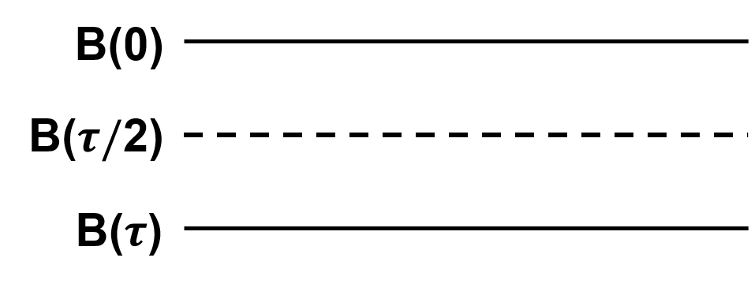
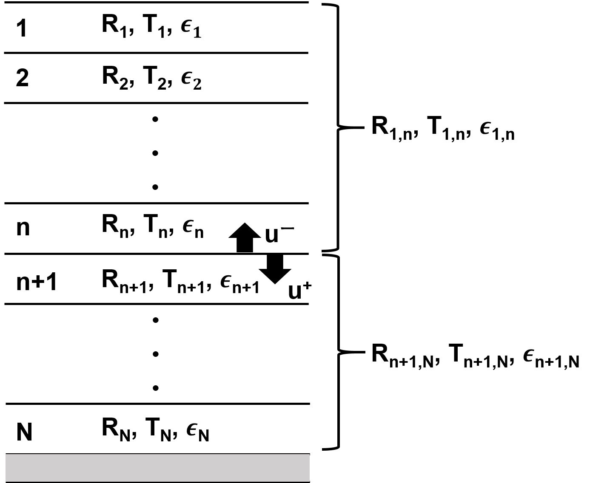

## Radiation scheme
### Summary of the radiation flux calculation
The  radiation scheme in the MIROC was created based on the Discrete Ordinate Method and the $k$-distribution Method (Nakajima et al., 2000), and updated by Sekiguchi and Nakajima (2008). The scheme calculates the value of the radiation flux at each level by considering the absorption, emission, and scattering processes of terrestrial and solar radiation by gases and clouds/aerosols. The main input data are temperature $T$, specific humidity $q$, cloud water $l$, and cloud cover $C$. The output data are shortwave or longwave upward and downward radiation fluxes $F^{\mp}$, and derivative coefficient to surface temperature $\mathrm{d}F^{\mp}/dT_{g}$, surface downward radiation flux $F_{sf}^{+}$, and 0.5 and 0.67 µm optical thickness $\tau^{vis}$. 

The calculation is separated for several wavelength bands. It is further divided into several sub-channels, based on the $k$-distribution method. As for gaseous absorption, the line absorption in $\mathrm{H}_{2} \mathrm{O}$, $\mathrm{C}\mathrm{O}_{2}$, $\mathrm{O}_{2}$, $\mathrm{O}_{3}$, $\mathrm{N}_{2} \mathrm{O}$, $\mathrm{C}\mathrm{H}_{4}$, the continuous absorption in $\mathrm{H}_{2} \mathrm{O}$, $\mathrm{C}\mathrm{O}_{2}$, $\mathrm{O}_{2}$, $\mathrm{O}_{3}$, and the CFC absorption are incorporated. As for scattering, Rayleigh scattering of gases and scattering by cloud and aerosol particles are considered.

Major subroutines used to calculate the radiation flux in `SUBROUTINE:[DTRN31]` of pradt.F are as follows.

1. Calculate the Planck function from atmospheric temperature `SUBROUTINE:[PLANKS, PLANKF]`
2. Calculate the optical thickness  to the gas in each sub-channel `SUBROUTINE:[PTFIT2]`
3. Calculate the optical thickness to the CFC absorption `SUBROUTINE:[CNTCFC2]`
4. Calculate the optical thickness to aerosol, Rayleigh scattering, and cloud `SUBROUTINE:[SCATAE, SCATRY, SCATCL]`
5. Expand the Planck function by optical thickness for each sub-channel `SUBROUTINE:[PLKEXP]`
6. Calculate the transmission coefficient (T), reflection coefficient (R) and source function (S) `SUBROUTINE:[TWST]`
7. Make T, R, and S matrixes for maximal/random approximation `SUBROUTINE:[RTSMR]`
8. Calculate the radiation flux by adding method `SUBROUTINE:[ADDMR, ADDING]`

![Flowchart of `SUBROUTINE:[DTRN31]`](Prad_Fig1.png)

To account for the partial coverage of clouds, the transmission and reflection coefficients and source functions for each layer are calculated at weighted average of the cloud cover, separately for cloud cover and clear-sky conditions. The cloud cover of the cumulus is also considered. In addition, it also performs several adding and calculates the clear-sky radiation flux.

###  Wavelength and Sub-channel

The basics of radiative flux calculations are represented by Beer-Lambert's Law.

$$
\begin{eqnarray}
  F^\lambda(z) = F^\lambda(0) exp (-k^\lambda z)
\end{eqnarray}
$$

$F^{\lambda}$ is the radiant flux density at the wavelength of $\lambda$ and $k^{\lambda}$ is the absorption coefficient. In order to calculate the radiative fluxes related to the heating rate, the integration operation with respect to the wavelength is required.

$$
\begin{eqnarray}
  F(z) = \int F^\lambda(z) d \lambda= \int F^\lambda(0) exp (-k^\lambda z) d \lambda\
\end{eqnarray}
$$

However, it is not easy to calculate this integration precisely because the absorption and emission of radiation by gas molecules have the complicated wavelength dependence of the absorption line attributed to the structure of the molecule. The k-distribution method is a method designed to make the relatively precise calculation easier. Within a certain wavelength range, considering the density function $F(k)$ for $\lambda$ of the absorption coefficient of $k$, the above formula is approximated as follows,
$$
\begin{eqnarray}
 \int F^\lambda(0) exp (-k^\lambda z) d \lambda
 \simeq \int \bar{F}^k(0) exp (-k z) F(k) dk
\end{eqnarray}
$$
where $\bar{F}^k(0)$ is the flux averaged over a wavelength having the absorption coefficient in this wavelength $k$ in $z=0$.

If $\bar{F}^k(0)$ and $F(k)$ are a relatively smooth functions to the $k$, 
$$
\begin{eqnarray}
 \int F^\lambda(0) exp (-k^\lambda z) d \lambda
 \simeq \sum \bar{F}^i(0) exp (-k^i z) F^i
\end{eqnarray}
$$
the formula, as such above, can be relatively precisely calculated by the addition of a finite number (sub-channels) of exponential terms. This method has furthermore the advantage easy to consider the absorption and scattering at the same time.

In the MIROC 6.0, by changing the radiation parameter data, the calculations can be performed at various wavelengths. In the standard version, the wavelength range is divided into 29 parts. In addition, each wavelength range is divided into 1 to 6 sub-channels (corresponding to the $i$ in the above formula). There are 111 channels in total. The wavelength range is divided by the wavenumber ( $\mathrm{cm}^{-1}$ ), 1, 250, 400, 530, 610, 670, 750, 820, 980, 1175, 1225, 1325, 1400, 2000, 2500, 3300, 3800, 4700, 5200, 6000, 10000, 12750, 13250, 14750, 23000, 30000, 33500, 36000, 43500, 50000. Additionally, a chemical version is also with 37 bands and 126 channels for chemical transport model and the boundary of the shortwave region is also changed to 54000 $\mathrm{cm}^{-1}$.

### Calculation of the Planck function

In this section, `SUBROUTINE:[PLANKS, PLANKF]` in pradt.F is described. 

The Planck function $\bar{B}^{w}(T)$, integrated in each wavelength range, is evaluated by the following formula.
$$
\begin{equation}
\bar{B}^{w}(T)=\lambda^{-2}{Texp}\left\{\sum_{n=1}^{5} B_{n}^{w}\left(\bar{\lambda}^{w} T\right)^{-n}\right\}
\end{equation}
$$
where $\bar{\lambda}^{w}$ is the averaged wavelength of the wavelength range, $B_{n}^{w}$ is the parameter determined by function fitting. This is calculated to the atmospheric temperature of each layer $T_l$, and the boundary atmospheric temperature of each layer $T_{l+1/2}$, surface temperature $T_g$ and temperature $1\mathrm{K}$ higher than surface temperature $T_{g+1K}$. The calculations are performed for each wavelength and each layer. In the following description, the subscript of the wavelength range $w$ is omitted.

###  Calculation of the optical thickness to gas absorption

In this section, `SUBROUTINE:[PTFIT2]` in pradt.F is described.

The optical thickness of the gas absorption (the line and continuum absorption are unified) $\tau^{K D}$ is expressed as follows by using the index $m$ as the type of molecules.
$$
\begin{equation}
\tau^{KD}=\sum_{m=1} k^{(m)} C^{(m)}
\end{equation}
$$
where $k^{(m)}$ is the absorption coefficient of the molecule $m$, which is different for each sub-channel and determined as a function of temperature $T$ and atmospheric pressure $p$. $C^{(m)}$ represents the amount of gas in the layer represented by $\mathrm{mol} / \mathrm{cm}^{2} / \mathrm{km}$, calculated by using the gas concentration $r^{(m)}$ in ppmv ( $C^{(m)}=10^{-1} r^{(m)} \rho d z$ ). In the MIROC 6.0, the number of the considered molecule types $m$ is 6 (1:$\mathrm{H}_{2} \mathrm{O}$, 2:$\mathrm{C}\mathrm{O}_{2}$,  3:$\mathrm{O}_{3}$, 4:$\mathrm{N}_{2} \mathrm{O}$, 5:$\mathrm{C}\mathrm{H}_{4}$, 6:$\mathrm{O}_{2}$). Also, $k^{(m)}$ is represented as follows (the details are in Sekiguchi and Nakajima, 2008).
$$
\begin{equation}
k^{(m)}=\exp \left(\log 10 k_{2}^{(m)}+(A+B T) \log \left(T / T_{\text {ref2 } }\right)\right)
\end{equation}
$$

$$
\begin{equation}
B=\left[\frac{\log 10\left(k_{3}^{(m)}-k_{2}^{(m)}\right)}{\log \left(\frac{T_{r e f 3}}{T_{r e f 2}}\right)}-\frac{\log 10\left(k_{1}^{(m)}-k_{2}^{(m)}\right)}{\log \left(\frac{T_{\text {ref1} }}{T_{\text {ref2}}}\right)}\right] /\left(T_{\text {ref3}}-T_{\text {ref1 }}\right)
\end{equation}
$$

$$
\begin{equation}
A=\frac{\log 10\left(k_{3}^{(m)}-k_{2}^{(m)}\right)}{\log \left(T_{\text {ref3 } } / T_{\text {ref2 } }\right)}-B T_{\text {ref3 }}
\end{equation}
$$

$ T_ {ref1-3}$ are the reference temperatures prepared in advance (200, 260, 320 $K$), and $k_{1-3}^{(m)}$ are the absorption coefficients when the reference temperatures  $ T_{ref1-3}$ is used (also fitted at 26 atmospheric pressure grids).

When considering the absorption of $\mathrm{H}_{2} \mathrm{O}$, we calculate the optical thickness of the self-broadening and add $\tau^{self}$.
$$
\begin{equation}
\tau^{K D\left(\mathrm{H}_{2} \mathrm{O}\right)}=\tau^{K D\left(\mathrm{H}_{2} \mathrm{O}\right)}+\tau^{\text {self }}
\end{equation}
$$

$$
\begin{equation}
\tau^{\text {self }}=\frac{k^{\left(\mathrm{H}_{2} \mathrm{O}_{-} \mathrm{self}\right)} C^{\left(\mathrm{H}_{2} \mathrm{O}\right)^{2}}}{C^{\left(\mathrm{H}_{2} \mathrm{O}\right)}+\rho d z 10^{5}}
\end{equation}
$$

$k^{(\mathrm{H}_{2} \mathrm{O}_{-} \mathrm{self})}$ is calculated in the same way as $k^{(m)}$. The self-broadening absorption coefficients in the reference temperatures $T_{ref1-3}$ are prescribed and dependent on the pressure. In the above formula, $10^{5}$ is multiplied to convert the unit from $\mathrm{km}$ to $\mathrm{cm}$. This calculation is done for each sub-channel and each layer.

###  Calculation of the optical thickness to CFC absorption

In this section, `SUBROUTINE:[CNTCFC2]` in pradt.F is described.

The optical thickness of the CFC absorption $\tau^{CFC}$ is considered for several types of CFCs $m$.
$$
\begin{equation}
\tau^{C F C}=\sum_{m} 10^{k^{(m)}} r^{(m)} \rho \Delta z 10^{-1}
\end{equation}
$$
In MIROC 6.0, the number of the considered CFCs $m$ is 28 (1:$\mathrm{CFC\text{-11}}$, 2:$\mathrm{CFC\text{-12}}$, 3:$\mathrm{CFC\text{-13}}$, 4:$\mathrm{CFC\text{-14}}$, 5:$\mathrm{CFC\text{-113}}$, 6:$\mathrm{CFC\text{-114}}$, 7:$\mathrm{CFC\text{-115}}$, 8:$\mathrm{HCFC\text{-21}}$, 9:$\mathrm{HCFC\text{-22}}$, 10:$\mathrm{HCFC\text{-123}}$, 11:$\mathrm{HCFC\text{-124}}$, 12:$\mathrm{HCFC\text{-141b}}$, 13:$\mathrm{HCFC\text{-142b}}$, 14:$\mathrm{HCFC\text{-225ca}}$, 15:$\mathrm{HCFC\text{-225cb}}$, 16:$\mathrm{HFC\text{-32}}$, 17:$\mathrm{HFC\text{-125}}$, 18:$\mathrm{HFC\text{-134}}$, 19:$\mathrm{HFC\text{-134a}}$, 20:$\mathrm{HFC\text{-143a}}$, 21:$\mathrm{HFC\text{-152a}}$, 22:$\mathrm{S}\mathrm{F}_{6}$, 23:$\mathrm{ClON}\mathrm{O}_{2}$, 24:$\mathrm{C}\mathrm{Cl}_{4}$, 25:$\mathrm{N}_{2}\mathrm{O}_{5}$, 26:$\mathrm{C}_{2}\mathrm{F}_{6}$, 27:$\mathrm{HN}\mathrm{O}_{4}$, 28:$\mathrm{SF}_{5}\mathrm{CF}_{3}$). In the above formula, $10^{-1}$ is multiplied to convert from $\mathrm{km}$ to $\mathrm{cm}$, and from ppmv to ratio. This calculation is done for each sub-channel and each layer. This calculation is performed for each layer and the wavelength range from about 540 to 1800 $\mathrm{cm}^{-1}$.

### Optical thickness to scattering and scattering moment

Calculate the optical thickness of scattering and the scattering moment. These calculations are performed for each wavelength and each layer. The optical parameters for the particle matter $q_{m}^{(p)}$ are prepared, including the extinction coefficient ($m = 1$) including the scattering and absorption process and the absorption coefficient ($m = 2$) the moments of the volume scattering phase function ($m=3\text{-}4$: first-second order).

#### Aerosol

In this section, `SUBROUTINE:[SCATAE]` in pradt.F is described.

The optical thickness $\tau^{a e}$, the part of the optical thickness  due to absorption $\tau_{ab}^{a e}$,  the scattering moment $Q_{m}^{a e}$ for aerosol are
$$
\begin{equation}
\tau^{a e}=\sum_{p} q_{1, n}^{(p)} r^{(p)} \times \rho \Delta z 10^{-1}
\end{equation}
$$

$$
\begin{equation}
\tau_{ab}^{a e}=\sum_{p} q_{2, n}^{(p)} r^{(p)} \times \rho \Delta z 10^{-1}
\end{equation}
$$

$$
\begin{equation}
Q_{m}^{a e}=\sum_{p} q_{m, n}^{(p)} r^{(p)} \times \rho \Delta z 10^{-1} (\mathrm{~m} \geq 3)
\end{equation}
$$

$p$ is the aerosol type, and $r^{(p)}$ is volume mixing ratio of the particle. The optical parameters for the particle $q_{m, n}^{(p)}$ depend on the mode radius index $n$ prescribed for each particle (IRA). In the MIROC 6.0, the number of the considered aerosol types $p$ 15 (1-6:soil dust (bin1-6), 7:carbonaceous (BC/OC=0.3), 8:carbonaceous (BC/OC=0.15), 9:carbonaceous (BC/OC=0), 10:black carbon (external mixture), 11:sulfate, 12-15:sea salt (bin 1-4)).

If the aerosol radius is used, the optical thickness $\tau^{a e}$, the part of the optical thickness  due to absorption $\tau_{ab}^{a e}$, and the scattering moment $Q_{m}^{a e}$ for the hygroscopic aerosols (e.g., carbonaceous, sulfate, sea salt) are
$$
\begin{equation}
\tau^{a e}=\sum_{p}\left[\left(1-F X_{a e}\right) q_{1, n f i t}^{(p)} r^{(p)}+F X_{a e} q_{1, n f i t+1}^{(p)} r^{(p)}\right] \times \rho \Delta z 10^{-1}
\end{equation}
$$

$$
\begin{equation}
\tau_{ab}^{a e}=\sum_{p}\left[\left(1-F X_{a e}\right) q_{2, n f i t}^{(p)} r^{(p)}+F X_{a e} q_{2, n f i t+1}^{(p)} r^{(p)}\right] \times \rho \Delta z 10^{-1}
\end{equation}
$$

$$
\begin{equation}
Q_{m}^{a e}=\sum_{p}\left[\left(1-F X_{a e}\right) q_{m, n f i t}^{(p)} r^{(p)}+F X_{a e} q_{m, n f i t+1}^{(p)} r^{(p)}\right] \times \rho \Delta z 10^{-1}(\mathrm{~m} \geq 2)
\end{equation}
$$

$$
\begin{equation}
F X_{a e}=\left(R H-R H_{n f i t}^{(r e f)}\right)\left(\frac{1}{R H_{n f i t+1}^{(r e f)}-R H_{n f i t}^{(r e f)}}\right)
\end{equation}
$$

where $RH$ is the local relative humidity and $R H_{n f i t}^{(r e f)}$ is the relative humidity given in the parameter and $nfit$ is the number of the prescribed relative humidity closest to the $RH$. $nfit$ and $FX_{ae}$ are calculated in the `SUBROUTINE:[RMDIDX]` in pradt.F and determined in advance. In the above formulas, $10^{-1}$ is multiplied to convert from $\mathrm{km}$ to $\mathrm{cm}$, and from ppmv to ratio. 

#### Rayleigh scattering `[SCATRY]`

In this section, `SUBROUTINE:[SCATRY]` in pradt.F is described.

The optical thickness $\tau^{r}$ of Rayleigh scattering and the part of the optical thickness  due to absorption $\tau_{ab}^{r}$ are

$$
\begin{equation}
\tau^{r}=\frac{e^{r} d p q m o l_{1}}{p_{S T D}}
\end{equation}
$$

$$
\begin{equation}
\tau_{ab}^{r}=\frac{e^{r} d p q m o l_{2}}{p_{S T D}}
\end{equation}
$$

$$
\begin{equation}
p_{S T D}=1013.25
\end{equation}
$$

where $e^{r}$ is the Rayleigh scattering coefficient, $qmol_m$ is the moments of the phase function. These calculations are performed up to $m=2$. Also, this is added to the optical thickness for the aerosol.
$$
\begin{equation}
\tau^{a e+r}=\tau^{a e}+\tau^{r}
\end{equation}
$$

$$
\begin{equation}
\tau_{ab}^{a e+r}=\tau_{ab}^{a e}+\tau_{ab}^{r}
\end{equation}
$$

####  Cloud 

In this section, `SUBROUTINE:[SCATCL]` in pradt.F is described.

The optical thickness $\tau^{cl}$, the part of the optical thickness  due to absorption $\tau_{ab}^{cl}$, and the scattering moment $Q_{m}^{c l}$ for cloud are
$$
\begin{equation}
\tau^{c l}=\sum_{c t} q_{1, n}^{(c t)}r^{(c t)}\times \rho \Delta z 10^{-1}
\end{equation}
$$

$$
\begin{equation}
\tau_{ab}^{c l}=\sum_{c t} q_{2, n}^{(c t)}r^{(c t)}\times \rho \Delta z 10^{-1}
\end{equation}
$$

$$
\begin{equation}
Q_{m}^{c l}=\sum_{c t} q_{m, n}^{(c t)} \times r^{(c t)} \rho \Delta z 10^{-1}(\mathrm{~m} \geq 3)
\end{equation}
$$

$ct$ is the cloud particle type (1:liquid cloud, 2:ice cloud). The optical parameters for the particle $q_{m, n}^{(c t)}$ depend on the mode radius index $n$  prescribed for each particle (IRC). If the cloud radius is used, the optical thickness $\tau^{cl}$, the part of the optical thickness  due to absorption $\tau_{ab}^{cl}$, and the scattering moment $Q_{m}^{c l}$ for cloud are
$$
\begin{equation}
\tau^{c l}=\sum_{c t}\left[\left(1-F X_{c l}\right) q_{1, n f i t}^{(c t)} r^{(c t)}+F X_{c l} q_{1, n f i t+1}^{(c t)} r^{(c t)}\right] \times \rho \Delta z 10^{-1}
\end{equation}
$$

$$
\begin{equation}
\tau_{ab}^{c l}=\sum_{c t}\left[\left(1-F X_{c l}\right) q_{2, n f i t}^{(c t)} r^{(c t)}+F X_{c l} q_{2, n f i t+1}^{(c t)} r^{(c t)}\right] \times \rho \Delta z 10^{-1}
\end{equation}
$$

$$
\begin{equation}
Q_{m}^{c l}=\sum_{c t}\left[\left(1-F X_{c l}\right) q_{m, n f i t}^{(c t)} r^{(c t)}+F X_{c l} q_{m, n f i t+1}^{(c t)} r^{(c t)}\right] \times \rho \Delta z 10^{-1}(\mathrm{~m} \geq 3)
\end{equation}
$$

$$
\begin{equation}
F X_{c l}=\left(R^{(c t)}-R_{n f i t}^{(r e f)}\right)\left(\frac{1}{R_{n f i t+1}^{(r e f)}-R_{n f i t}^{(r e f)}}\right)
\end{equation}
$$

where $R^{(ct)}$ is the calculated mode radius and $R_{n f i t}^{(r e f)}$ is the mode radius given in the parameter and $nfit$ is the number of the prescribed mode radius closest to the $R^{(ct)}$. $nfit$ and $FX_{cl}$ are calculated in the subroutine `SUBROUTINE:[RMDIDX]` in pradt.F and determined in advance. In the above formulas, $10^{-1}$ is multiplied to convert from $\mathrm{km}$ to $\mathrm{cm}$, and from ppmv to ratio.

Finally, the total optical thickness for particle scattering, Rayleigh scattering and absorption $\tau^p$ and the contribution of scattering $\tau^{scat}$ are obtained as follows.
$$
\begin{equation}
\tau^{P}=\tau^{c l}+\tau^{a e+r}
\end{equation}
$$

$$
\begin{equation}
\tau^{s c a t}=\tau^{P}-\left(T_{ab}^{c l}+T_{ab}^{a e+r}\right)
\end{equation}
$$

In addition, the moments of the normalized phase function $G$ are calculated up to the three orders. The zeroth moment $G_1$ is trivial from the normalization condition of the phase function. The first and second moments $G_2$, $G_3$, are referred as the asymmetry factor $g$ and the truncation factor $f$. 
$$
\begin{equation}
G_{1}=1.0
\end{equation}
$$

$$
\begin{equation}
G_{m-1}=\frac{Q_{m}^{c l}+Q_{m}^{ae}}{\tau^{s c a t}}(m \geq 3), \quad G_{2}=g, \quad G_{3}=f
\end{equation}
$$

This calculation is divided into the cloudy, clear sky and cumulus conditions. In the cloudy and cumulus conditions, $\tau^{cl}$ in the 0.5 and 0.67 $\mathrm{{\mu}m}$ regions is as recorded as $\tau^{vis}$ in subroutine DTRN31.

**$R^{ct}$ is calculated in `SUBROUTINE:RADFLX` as follows.
$$
\begin{equation}
R^{(c t)}=\left(\frac{3}{4 \pi} \frac{\rho r^{(c t)}}{\rho_{w}^{(c t)} n_{c}^{(c t)}}\right)^{1 / 3}
\end{equation}
$$
$\rho_{w}^{(c t)}$ is the liquid or ice density. $r^{ct}$ is the amount of the liquid or ice cloud and calculated as follows. 
$$
\begin{equation}
r^{(c t)}=\frac{C_{s t} r_{s t}^{(c t)}+C_{c u} r_{c u}^{(c t)}}{1-\left(1-C_{s t}\right)\left(1-C_{c u}\right)}
\end{equation}
$$
$C$ is the area of the cloud, and the subscript $st$ and $cu$ mean the stratus and cumulus. When $r_{s t, c u}^{(c t)}$ is the small amount in the stratosphere, it is reset to 0. $n_{c}^{(c t)}$ is the number density of cloud particles.
$$
\begin{equation}
n_{c}^{(l i q)}=\max \left(\frac{q_{a e}^{l i q} p N_{A}}{R T_{v}\left(18 \times 10^{-3} R_{v} / R\right)}, f_{l i q} n_{\min }^{(l i q)}\right)
\end{equation}
$$

$$
\begin{equation}
n_{c}^{(i c e)}=\max \left(\frac{q_{a e}^{i c e} p N_{A}}{R T_{v}\left(18 \times 10^{-3} R_{v} R_{v} / R\right)},\left(1-f_{l i q}\right) n_{\min }^{(i c e)}\right)
\end{equation}
$$

where $q_{a e}^{l i q}$ is the mixing ratio of the aerosol particles calculated by the SPRINTERS and converted to the number concentration, and $n_{\min }^{(c t)}$ is the minimum number of the cloud particles. and $f_{liq}$ is liquid fraction. Also, $n_{c}^{(c t)}$ is calculated as follows when using OPT_AECL_SIMPLE.
$$
\begin{equation}
n_{c}^{(c t)}=\frac{\varepsilon n_{a} n_{m a x}^{(c t)}}{\varepsilon n_{a}+n_{\max }^{(c t)}}
\end{equation}
$$
where $n_a$ is the number density of aerosol particles give as an external condition, and $\varepsilon$ and $n_{\max }^{(c t)}$ are constants. $f_{liq}$ is calculated by the following formula using the amount of cloud water $w$ ($0 \leq f_{\text {liq }} \leq 1$).
$$
\begin{equation}
f_{l i q}=\frac{w_{s t} f_{l i q, s t}+w_{c u} f_{l i q, c u}}{w_{s t}+w_{c u}}
\end{equation}
$$

###  Total optical thickness `[DTRN31]`

All optical thickness including gaseous band absorption, and scattering is,
$$
\begin{equation}
\tau=\tau^{K D}+\tau^{C O N}+\tau^{P}
\end{equation}
$$
where because $\tau^{K D}$ is different for each subchannel, the calculation is done for each sub-channel and each layer, and divided into the cloudy, clear sky, and cumulus conditions.

###  Expansion of the plank function 

In this section, `SUBROUTINE:[PLKEXP]` in pradt.F is described.

In each layer, the Planck function $B$ is expanded as follows and the expansion coefficients $b_0$, $b_1$, and $b_2$, are obtained.
$$
\begin{equation}
{B}\left(\tau^{\prime}\right)=b_{0}+b_{1} \tau^{\prime}+b_{2}\left(\tau^{\prime}\right)^{2}
\end{equation}
$$
Here, as ${B}\left(\tau^{\prime}\right)$, $B$ at the top of each layer (the boundary with the top layer) is used, and as ${B}(\tau)$, $B$ at the bottom edge of each layer (the boundary with the layer below), and as ${B}(\tau / 2)$, the $B$ at the representative level of each layer.
$$
\begin{equation}
b_{0}=B(0)
\end{equation}
$$

$$
\begin{equation}
b_{1}=(4{~B}(\tau / 2)-{B}(\tau)-3{~B}(0)) / \tau
\end{equation}
$$

$$
\begin{equation}
b_{2}=2({~B}(\tau)-{B}(0)-2{~B}(\tau / 2)) / \tau^{2}
\end{equation}
$$

This calculation is done for each sub-channel and each layer and divided into the cloudy, clear sky and cumulus conditions.

###  Transmission and reflection coefficients, and source function

In this section, `SUBROUTINE:[TWST]` in pradt.F is described.

Using the obtained optical thickness $\tau$, optical thickness of scattering $\tau^{scat}$, scattering moments $g$, $f$, expansion coefficients for Planck function $b_n$, and solar incidence angle factor $\mu_{0}$, the transmission coefficient $T$, reflection coefficient $R$, downward radiation source function $\epsilon^{+}$, and the upward radiation source function $\epsilon^{-}$ are founded, by assuming a uniform layer and using the two-stream approximation.

The single-scattering albedo $\omega$ is,
$$
\begin{equation}
\omega=\tau^{\text{scat}}/\tau
\end{equation}
$$
The optical thickness $\tau^{*}$, the single-scattering albedo $\omega^{*}$, and asymmetric factor $g^{*}$, corrected by the contribution from the forward scattering factor $f$ are,
$$
\begin{equation}
\tau^{*}=\tau(1-\omega f)
\end{equation}
$$

$$
\begin{equation}
\omega^{*}=\frac{(1-f) \omega}{1-\omega f}
\end{equation}
$$

$$
\begin{equation}
g^{*}=\frac{g-f}{1-f}
\end{equation}
$$

$\mu$ is a two-stream directional cosine.
$$
\begin{equation}
\mu \equiv\left(\frac{1}{\sqrt{3}}, \frac{1}{1.66}\right) \text { (shortwave, longwave) }
\end{equation}
$$

$$
\begin{equation}
W^{-} \equiv \mu^{-1 / 2}
\end{equation}
$$

Furthermore,
$$
\begin{equation}
\hat{P}^{\pm}=\omega^{*} W^{-2}\left(1 \pm 3 g^{*} \mu^{2}\right) / 2
\end{equation}
$$

$$
\begin{equation}
\hat{S}_{s}^{\pm}=\omega^{*} W^{-}\left(1 \pm 3 g^{*} \mu_{0} \mu\right)
\end{equation}
$$

can be determined as above as a normalized scattering phase function.
$$
\begin{equation}
\begin{aligned}
X &=\mu^{-1}-\left(\hat{P}^{+}-\hat{P}^{+}\right) \\
&=\mu^{-1}-3 \omega^{*} W^{-2} \mu^{2} g^{*} \\
\end{aligned}
\end{equation}
$$
$$
\begin{equation}
\begin{aligned}
Y &=\mu^{-1}-\left(\hat{P}^{+}+\hat{P}^{+}\right) \\
&=\mu^{-1}-\omega^{*} W^{-2} \\
\end{aligned}
\end{equation}
$$

$$
\begin{equation}
\begin{aligned}
\hat{\sigma}_{S}^{+} &=\hat{S}_{S}^{+}+\hat{S}_{S}^{-} \\
&=\omega^{*} W^{-} \\
\end{aligned}
\end{equation}
$$

$$
\begin{equation}
\begin{aligned}
\hat{\sigma}_{S}^{-} &=\hat{S}_{s}^{+}-\hat{S}_{S}^{-} \\
&=3 \omega^{*} \mu_{0} W^{-} \mu g^{*}
\end{aligned}
\end{equation}
$$

Using the above formula, the reflectance $R$ and transmission $T$ become
$$
\begin{equation}
\begin{array}{c}
A A=\frac{X\left(1+e^{-\lambda \tau^{*}}\right)-\lambda\left(1-e^{-\lambda \tau^{*}}\right)}{X\left(1+e^{-\lambda \tau^{*}}\right)+\lambda\left(1-e^{-\lambda \tau^{*}}\right)} \\
\end{array}
\end{equation}
$$
$$
\begin{equation}
\begin{array}{c}
B B=\frac{X\left(1-e^{-\lambda \tau^{*}}\right)-\lambda\left(1+e^{-\lambda \tau^{*}}\right)}{X\left(1-e^{-\lambda \tau^{*}}\right)+\lambda\left(1+e^{-\lambda \tau^{*}}\right)} \\
\end{array}
\end{equation}
$$

$$
\begin{equation}
\begin{array}{c}
\lambda=\sqrt{X Y} \\
\end{array}
\end{equation}
$$

$$
\begin{equation}
\begin{array}{c}
R=\frac{1}{2}(A A+B B) \\
\end{array}
\end{equation}
$$

$$
\begin{equation}
\begin{array}{c}
T=\frac{1}{2}(A A-B B)
\end{array}
\end{equation}
$$

Next, we find the source function derived from the Planck function.
$$
\begin{equation}
\hat{b}_{n}=2 \pi\left(1-\omega^{*}\right) W^{-}\left(\frac{1}{1-\omega f}\right)^{n} b_{n}
\end{equation}
$$
The expansion coefficients of the radiation source function can be found from the above formulas.
$$
\begin{equation}
\begin{array}{l}
D_{2}^{\pm}=\frac{\hat{b}_{2}}{Y} \\
\end{array}
\end{equation}
$$
$$
\begin{equation}
\begin{array}{l}
D_{1}^{\pm}=\frac{\hat{b}_{1}}{Y} \mp \frac{2 \hat{b}_{2}}{X Y} \\
\end{array}
\end{equation}
$$

$$
\begin{equation}
\begin{array}{l}
D_{0}^{\pm}=\frac{\hat{b}_{0}}{Y}+\frac{2 \hat{b}_{2}}{X Y^{2}} \mp \frac{\hat{b}_{1}}{X Y} \\
\end{array}
\end{equation}
$$

$$
\begin{equation}
\begin{array}{l}
D^{\pm}\left(\tau^{*}\right)=D_{0}^{+}+D_{1}^{+} \tau^{*}+D_{2}^{+} \tau^{* 2}
\end{array}
\end{equation}
$$

The radiation source function derived from the Planck function $\hat{\epsilon}_{A}^{\pm}$ is
$$
\begin{equation}
\begin{array}{l}
\hat{\epsilon}_{A}^{-}=D_{0}^{-}-R D_{0}^{-}-T D^{-}\left(\tau^{*}\right) \\
\end{array}
\end{equation}
$$
$$
\begin{equation}
\begin{array}{l}
\hat{\epsilon}_{A}^{+}=D^{+}\left(\tau^{*}\right)-T D_{0}^{+}-R D^{-}\left(\tau^{*}\right)
\end{array}
\end{equation}
$$

On the other hand, the radiation source function of the solar-induced radiation is
$$
\begin{equation}
\begin{array}{l}
\hat{\epsilon}_{S}^{+}=F_{\text {sol }}\left(V_{s}^{+} e^{-\frac{\tau^{*}}{\mu_{0}}}-T V_{s}^{+}-R V_{s}^{-} e^{-\frac{\tau^{*}}{\mu_{0}}}\right)
\end{array}
\end{equation}
$$
$$
\begin{equation}
\begin{array}{l}
\hat{\epsilon}_{S}^{+}=F_{\text {sol }}\left(V_{s}^{+} e^{-\frac{\tau^{*}}{\mu_{0}}}-T V_{s}^{+}-R V_{s}^{-} e^{-\frac{\tau^{*}}{\mu_{0}}}\right)
\end{array}
\end{equation}
$$

Here, $Q \gamma$ and $V_{s}^{\pm}$ are expressed by the following formulas, and $F_{sol}$ is solar irradiance.
$$
\begin{equation}
\begin{array}{c}
V_{s}^{\pm}=\frac{1}{2}\left[Q \gamma \pm\left(\frac{Q \gamma}{\mu_{0}}+\frac{\hat{\sigma}_{S}^{-}}{X}\right)\right] \\
\end{array}
\end{equation}
$$
$$
\begin{equation}
\begin{array}{c}
Q \gamma=\frac{X \hat{\sigma}_{S}^{+} \mu_{0}+\mu_{0}^{-1} \hat{\sigma}_{S}^{-}}{X Y \mu_{0}+\mu_{0}^{-1}}
\end{array}
\end{equation}
$$

The direct solar transmission is also calculated in this subroutine.
$$
\begin{equation}
E x^{d i r}=e^{-\tau^{*}/ \mu_{0}}
\end{equation}
$$
This calculation is done for each sub-channel and each layer and divided into the cloudy, clear sky, and cumulus conditions.

### T, R, S matrixes for maximal/random approximation 

In this section, `SUBROUTINE:[RTSMR]` in pradt.F is described.

In this subroutine, T, R, S matrixes for maximal/random approximation is made. The radiation source function, which is the sum of both the plank function and the solar incident origins, is
$$
\begin{equation}
\begin{array}{l}
\epsilon^{-(\text {cloud})}=\hat{\epsilon}_{S}^{-(\text {cloud})} {Tr}^{(\text {cloud})}+\hat{\epsilon}_{A}^{-(\text {cloud})} C \\
\end{array}
\end{equation}
$$
$$
\begin{equation}
\begin{array}{l}
\epsilon^{-(\text {clear})}=\hat{\epsilon}_{S}^{-(\text {clear})}{Tr}^{(\text {clear})}+\hat{\epsilon}_{A}^{-(\text {clear})}(1-C) \\
\end{array}
\end{equation}
$$

$$
\begin{equation}
\begin{array}{l}
\epsilon^{+(\text {cloud})}=\hat{\epsilon}_{S}^{+(\text {cloud})}{Tr}^{(\text {cloud})}+\hat{\epsilon}_{A}^{-(\text {cloud})} C \\
\end{array}
\end{equation}
$$

$$
\begin{equation}
\begin{array}{l}
\epsilon^{+(\text {clear})}=\hat{\epsilon}_{S}^{+(\text {clear})}{Tr}^{(\text {clear})}+\hat{\epsilon}_{A}^{-(\text {clear})}(1-C)
\end{array}
\end{equation}
$$

$Tr$ is the direct solar transmission for maximal/random approximation and calculated as follows in `SUBROUTINE:DTRN31`.
$$
\begin{equation}
\begin{aligned}
\operatorname{Tr}_{n}^{(\text {cloud})} &=E x_{n}^{(\text {cloud})} B_{n}^{(3)}+E x_{n}^{(\text {clear})}\left(1-B_{n}^{(1)}\right) \\
\end{aligned}
\end{equation}
$$
$$
\begin{equation}
\begin{aligned}
E x_{n+1}^{(\text {cloud})} &={Tr}_{n}^{(\text {cloud})} E x_{n}^{\operatorname{dir}(\text {cloud})} \\
\end{aligned}
\end{equation}
$$

$$
\begin{equation}
\begin{aligned}
T r_{n}^{(\text {clear})} &=E x_{n}^{(\text {cloud})}\left(1-B_{n}^{(3)}\right)+E x_{n}^{(\text {clear})} B_{n}^{(1)} \\
\end{aligned}
\end{equation}
$$

$$
\begin{equation}
\begin{aligned}
E x_{n+1}^{(\text {clear)} }&={Tr}_{n}^{(\text {clear})} E x_{n}^{\text {dir}(\text {clear})}
\end{aligned}
\end{equation}
$$

$Ex$ is the cumulative direct solar transmission. $B_{n}^{(1-4)}$ is the cloud cover interaction index and calculated in `SUBROUTINE:[BCVR]`in pradt.F .
$$
\begin{equation}
\begin{array}{l}
B_{n}^{(1)}=\frac{1-\max \left(C_{n-1}, C_{n}\right)}{1-C_{n-1}} \\
\end{array}
\end{equation}
$$
$$
\begin{equation}
\begin{array}{l}
B_{n}^{(2)}=\frac{1-\max \left(C_{n+1}, C_{n}\right)}{1-C_{n+1}} \\
\end{array}
\end{equation}
$$

$$
\begin{equation}
\begin{array}{l}
B_{n}^{(3)}=\frac{\min \left(C_{n-1}, C_{n}\right)}{C_{n-1}} \\
\end{array}
\end{equation}
$$

$$
\begin{equation}
\begin{array}{l}
B_{n}^{(4)}=\frac{\min \left(C_{n+1}, C_{n}\right)}{C_{n+1}}
\end{array}
\end{equation}
$$

Next, T matrixes for maximal/random approximation are calculated.
$$
\begin{equation}
\begin{array}{l}
T^{+(cloud, 1)}=T^{(\text {cloud})} B^{(3)} \\
\end{array}
\end{equation}
$$

$$
\begin{equation}
\begin{array}{l}
T^{+(\text {cloud}, 2)}=T^{(\text {cloud})}\left(1-B^{(1)}\right)\\
\end{array}
\end{equation}
$$

$$
\begin{equation}
\begin{array}{l}
T^{+(\text {clear}, 1)}=T^{(\text {clear})}\left(1-B^{(3)}\right)\\
\end{array}
\end{equation}
$$

$$
\begin{equation}
\begin{array}{l}
T^{+(\text {clear}, 2)}=T^{(\text {clear})} B^{(1)} \\
\end{array}
\end{equation}
$$

$$
\begin{equation}
\begin{array}{l}
T^{-(\text {cloud}, 1)}=T^{(\text {cloud})} B^{(4)} \\
\end{array}
\end{equation}
$$

$$
\begin{equation}
\begin{array}{l}
T^{-(\text {cloud}, 2)}=T^{(\text {cloud})}\left(1-B^{(2)}\right)\\
\end{array}
\end{equation}
$$

$$
\begin{equation}
\begin{array}{l}
T^{-(\text {clear}, 1)}=T^{(\text {clear})}\left(1-B^{(4)}\right)\\
\end{array}
\end{equation}
$$

$$
\begin{equation}
\begin{array}{l}
T^{-(\text {clear}, 2)}=T^{(\text {clear})} B^{(2)}
\end{array}
\end{equation}
$$

Also, R matrixes for maximal/random approximation are calculated.
$$
\begin{equation}
\begin{array}{l}
R^{+(\text {cloud}, 1)}=R^{(\text {cloud})} B^{(3)} \\
\end{array}
\end{equation}
$$
$$
\begin{equation}
\begin{array}{l}
R^{+(\text {cloud}, 2)}=R^{(\text {cloud})}\left(1-B^{(1)}\right) \\
\end{array}
\end{equation}
$$

$$
\begin{equation}
\begin{array}{l}
R^{+(\text {clear}, 1)}=R^{(\text {clear})}\left(1-B^{(3)}\right) \\
\end{array}
\end{equation}
$$

$$
\begin{equation}
\begin{array}{l}
R^{+(\text {clear}, 2)}=R^{(\text {clear})} B^{(1)} \\
\end{array}
\end{equation}
$$

$$
\begin{equation}
\begin{array}{l}
R^{-(\text {cloud}, 1)}=R^{(\text {cloud})} B^{(4)} \\
\end{array}
\end{equation}
$$

$$
\begin{equation}
\begin{array}{l}
R^{-(\text {cloud,2})}=R^{(\text {cloud})}\left(1-B^{(2)}\right) \\
\end{array}
\end{equation}
$$

$$
\begin{equation}
\begin{array}{l}
R^{-(\text {clear}, 1)}=R^{(\text {clear})}\left(1-B^{(4)}\right) \\
\end{array}
\end{equation}
$$

$$
\begin{equation}
\begin{array}{l}
R^{-(\text {clear}, 2)}=R^{(\text {clear})} B^{(2)}
\end{array}
\end{equation}
$$

This calculation is done for each sub-channel and each layer.

###  Adding of source functions for each layer

In this section, `SUBROUTINE:[ADDMR or ADDING` in pradt.F is described.

By using transmission coefficient $T$, reflection coefficient $R$, and radiation source function $\varepsilon$ in all layers, the radiation fluxes $u$ at each layer boundary can be obtained by using the adding method. This means that the when two layers of $T$, $R$, $\varepsilon$ are known, the $T$, $R$, $\varepsilon$ of the whole combined layer of the two layers can be easily calculated.

####  `SUBROUTINE:[ADDMR]`

In this subroutine, the maximal/random flux in cloudy conditions is calculated by the adding method and the T, R, and S matrixes are used for calculations.

First, the upward radiation source function the bottom layer is calculated.

In the shortwave region,
$$
\begin{equation}
\begin{array}{l}
\epsilon_{N}^{-(\text {cloud})}=W^{+} \alpha_{s} \mu_{0}\left(\frac{1}{\mu}\right) F_{0} e_{N}^{-\left\langle\tau^{*}\right\rangle / \mu_{0}(\text{cloud})} \\
\end{array}
\end{equation}
$$
$$
\begin{equation}
\begin{array}{l}
\epsilon_{N}^{-(\text {clear})}=W^{+} \alpha_{s} \mu_{0}\left(\frac{1}{\mu}\right) F_{0} e_{N}^{-\left\langle\tau^{*}\right\rangle / \mu_{0} \text {(clear) }}
\end{array}
\end{equation}
$$

$\left\langle\tau^{*}\right\rangle$ indicates the total optical thickness $\tau^{*}$ of from the upper end of the atmosphere to the upper end of the layer currently being considered and $e^{-\left\langle\tau^{*}\right\rangle / \mu_{0}}$ is calculated in `SUBROUTINE:[ADDMR]` of pradt.F.

In the longwave region,
$$
\begin{equation}
\begin{array}{l}
\epsilon_{N}^{-(\text {cloud})}=\epsilon_{N}^{-(\text {cloud})}+W^{+} 2 \pi\left(1-\alpha_{s}\right) B_{N} C_{N} \\
\end{array}
\end{equation}
$$
$$
\begin{equation}
\begin{array}{l}
\epsilon_{N}^{-(\text {clear})}=\epsilon_{N}^{-(\text {clear})}+W^{+} 2 \pi\left(1-\alpha_{s}\right) B_{N}\left(1-C_{N}\right)
\end{array}
\end{equation}
$$

Here,
$$
\begin{equation}
W^{+} \equiv \mu^{1 / 2}
\end{equation}
$$
The reflectance $R_{1, n}^{-}$ and source function $\epsilon_{1, n}^{+}$ regarded from the first to the $n$ layers as a single layer are
$$
\begin{equation}
\begin{array}{l}
\epsilon_{1, n}^{+}=\epsilon_{n}^{+}+T_{n}^{+}\left(1-R_{n}^{+} R_{1, n-1}^{-}\right)^{-1}\left(R_{1, n-1}^{-} \epsilon_{n}^{-}+\epsilon_{1, n-1}^{+}\right) \\
\end{array}
\end{equation}
$$
$$
\begin{equation}
\begin{array}{l}
R_{1, n}^{-}=R_{n}^{-}+T_{n}^{+}\left(1-R_{n}^{+} R_{1, n-1}^{-}\right)^{-1} R_{1, n-1}^{-} T_{n}^{-}
\end{array}
\end{equation}
$$

The upward and downward fluxes at the bottom of the atmosphere are
$$
\begin{equation}
\begin{array}{l}
u_{N+1 / 2}^{+}=\left(1-R_{1, N-1}^{-} R_{N}^{+}\right)^{-1}\left(\epsilon_{1, N-1}^{+}+R_{1, N-1}^{-} \epsilon_{N}^{-}\right) \\
\end{array}
\end{equation}
$$

$$
\begin{equation}
\begin{array}{l}
u_{N+1 / 2}^{-}=\left(1-R_{N}^{+} R_{1, N-1}^{-}\right)^{-1}\left(\epsilon_{N}^{-}+R_{N}^{+} \epsilon_{1, N-1}^{+}\right)
\end{array}
\end{equation}
$$

Also, upward and downward fluxes at the boundary between layers $n$ and $n+1$ are
$$
\begin{equation}
\begin{array}{l}
u_{n+1 / 2}^{+}=\left(1-R_{1, n-1}^{-} R_{n}^{+}\right)^{-1}\left(R_{1, n-1}^{-} T_{n}^{-} u_{n+1 / 2}^{-}+R_{1, n-1}^{-} \epsilon_{n}^{-}+\epsilon_{1, n}^{+}\right) \\
\end{array}
\end{equation}
$$
$$
\begin{equation}
\begin{array}{l}
u_{n+1 / 2}^{-}=\left(1-R_{n}^{+} R_{1, n-1}^{-}\right)^{-1}\left(T_{n}^{-} u_{n+1 / 2}^{-}+R_{n}^{+} \epsilon_{1, n-1}^{+}+\epsilon_{n}^{-}\right)
\end{array}
\end{equation}
$$

However, the upward and downward flux at the upper end of the atmosphere is as follows.
$$
\begin{equation}
\begin{array}{l}
u_{1 / 2}^{+}=0 \\
\end{array}
\end{equation}
$$
$$
\begin{equation}
\begin{array}{l}
u_{1 / 2}^{-}=T_{1}^{-} u_{1+1 / 2}^{-}+\epsilon_{1}^{-}
\end{array}
\end{equation}
$$

Finally, since this flux is scaled, we rescaled and added the direct solar incidence to the find the radiation flux. Furthermore, the flux in the cloudy area and the clear sky area is added.
$$
\begin{equation}
\begin{array}{c}
F_{n+1 / 2}^{+}=\frac{W^{+}}{W}\left(u_{n+1 / 2}^{+(\text{cloud})}+u_{n+1 / 2}^{+(\text{clear})}\right)+\mu_{0} F_{0}\left(e_{n+1 / 2}^{-\left\langle\tau^{*}\right\rangle / \mu_{0}(\text {cloud})}\right) \\
\end{array}
\end{equation}
$$
$$
\begin{equation}
\begin{array}{c}
F_{n+1 / 2}^{-}=\frac{W^{+}}{W}\left(u_{n+1 / 2}^{-(\text{cloud})}+u_{n+1 / 2}^{-(\text {clear})}\right)
\end{array}
\end{equation}
$$

Also, surface direct downward radiation flux $F_{s f}^{+}$ is
$$
\begin{equation}
F_{s f}^{+}=\mu_{0} F_{0}\left(e_{N}^{-\left\langle\tau^{*}\right\rangle / \mu_{0}(\text {cloud})}+e_{N}^{-\left\langle\tau^{*}\right\rangle / \mu_{0} \text{(clear)}}\right)
\end{equation}
$$
This calculation is done for each sub-channel.

####  `SUBROUTINE:[ADDING]`

Since the maximal/random approximation cannot be used under the clear sky condition, this subroutine is used to calculate the flux.

First, the radiation source function, which is the sum of both the plank function origin and the solar incident origin, is
$$
\begin{equation}
\epsilon^{\pm}=\hat{\epsilon}_{S}^{\pm} e^{-\left\langle\tau^{*}\right\rangle / \mu_{0}}+\hat{\epsilon}_{A}^{\pm}
\end{equation}
$$
There are layers $1, 2…, N$ from the top. The surface layer is considered to be a single layer and the $N$ layer. Given the reflectance and source function of the layers from the n to the $N$ layer as a single layer $R_{n, N}$, $\epsilon_{n, N}^{-}$,
$$
\begin{equation}
\begin{array}{c}
R_{n, N}=R_{n, N}+T_{n}\left(1-R_{n+1, N} R_{n}\right)^{-1} R_{n+1} T_{n} \\
\end{array}
\end{equation}
$$
$$
\begin{equation}
\begin{array}{c}
\epsilon_{n, N}^{-}=\epsilon_{n}^{-}+T_{n}\left(1-R_{n+1, N} R_{n}\right)^{-1}\left(R_{n+1, N} \epsilon_{n}^{+}+\epsilon_{n, N}^{-}\right)
\end{array}
\end{equation}
$$

$$
\begin{equation}
\begin{array}{c}
R_{n, N}=R_{n, N}+T_{n}\left(1-R_{n+1, N} R_{n}\right)^{-1} R_{n+1} T_{n} \\
\end{array}
\end{equation}
$$

$$
\begin{equation}
\begin{array}{c}
\epsilon_{n, N}^{-}=\epsilon_{n}^{-}+T_{n}\left(1-R_{n+1, N} R_{n}\right)^{-1}\left(R_{n+1, N} \epsilon_{n}^{+}+\epsilon_{n, N}^{-}\right)
\end{array}
\end{equation}
$$

This can be solved by $n=N-1…,1$ in sequence, starting from the values at the surface $R_{N, N}$, $\epsilon_{N, N}^{-}$.
$$
\begin{equation}
\begin{array}{c}
R_{N, N}=R_{N}=\alpha_{s} \\
\end{array}
\end{equation}
$$
$$
\begin{equation}
\begin{array}{c}
\epsilon_{N, N}=W^{+}\left(\alpha_{s} \mu_{0}\left(\frac{1}{\mu}\right) e^{-\left\langle\tau^{*}\right\rangle / \mu_{0}} F_{0}+2 \pi\left(1-\alpha_{s}\right) B_{N}\right)
\end{array}
\end{equation}
$$

The reflectance $R_{1, n}$ and source function $\epsilon_{1, n}^{+}$ regarded from the first to the $n$ layers as a single layer are
$$
\begin{equation}
\begin{array}{c}
R_{1, n}=R_{n}+T_{n}\left(1-R_{1, n-1} R_{n}\right)^{-1} R_{1, n-1} T_{n} \\
\end{array}
\end{equation}
$$
$$
\begin{equation}
\begin{array}{c}
\epsilon_{1, N}^{+}=\epsilon_{n}^{+}+T_{n}\left(1-R_{1, n-1} R_{n}\right)^{-1}\left(R_{1, n-1} \epsilon_{n}^{-}+\epsilon_{1, n-1}^{+}\right)
\end{array}
\end{equation}
$$

It can be solved by $n=2,…, N$, starting from  $R_{1,1}=R_{1},  \epsilon_{1,1}^{+}=\epsilon_{1}^{+}$.

With these, downward flux at the boundary between layers $n$ and $n+1$, the downward and upward flux are came back to a problem between two layers of combined layer, the combinations of layers $1-n$ and $n+1-N$.
$$
\begin{equation}
\begin{array}{c}
u_{n+1 / 2}^{+}=\left(1-R_{1, n} R_{n+1, N}\right)^{-1}\left(\epsilon_{1, n}^{+}+R_{1, n} \epsilon_{n+1, N}^{-}\right) \\
\end{array}
\end{equation}
$$
$$
\begin{equation}
\begin{array}{c}
u_{n+1 / 2}^{-}=R_{n+1, N} u_{n, n+1}^{+}+\epsilon_{n+1, N}^{-}
\end{array}
\end{equation}
$$

can be written as above. However, the flux at the top of the atmosphere is
$$
\begin{equation}
\begin{array}{c}
u_{1 / 2}^{+}=0 \\
\end{array}
\end{equation}
$$
$$
\begin{equation}
\begin{array}{c}
u_{1 / 2}^{-}=\epsilon_{1, N}^{-}
\end{array}
\end{equation}
$$

Finally, since this flux is scaled, we rescaled and added the direct solar incidence to the find the radiation flux.
$$
\begin{equation}
\begin{array}{c}
F_{n+1 / 2}^{+}=\frac{W^{+}}{W} u_{n+1 / 2}^{+}+\mu_{0} e^{-\left\langle\tau^{*}\right\rangle / \mu_{0}} F_{0} \\
\end{array}
\end{equation}
$$
$$
\begin{equation}
\begin{array}{c}
F_{n+1 / 2}^{-}=\frac{W^{+}}{W} u_{n+1 / 2}^{-}
\end{array}
\end{equation}
$$

Also, surface direct downward radiation flux $F_{s f}^{+}$ is
$$
\begin{equation}
F_{s f}^{+}=\mu_{0} F_{0} e^{-\left\langle\tau^{*}\rangle\ \mu_{0}\right.}
\end{equation}
$$

### Adding in the flux

$$
\begin{equation}
F^{\pm}=\sum_{c} w_{c}\left(1-C_{c u}\right) \bar{F}^{\pm}+\sum_{c} w_{c} C_{c u} F^{c \pm}
\end{equation}
$$

$$
\begin{equation}
F^{\circ \pm}=\sum_{c} w_{c} F^{\circ \pm}
\end{equation}
$$

If the radiation flux $F_{C}^{\pm}$ is found for each sub-channel in each layer, the wavelength-integrated flux is found by multiplying a weight $w_c$ correspondingly to a wavelength representative of the sub-channel and adding. $C_{cu}$ is the horizontal coverage of the cumulus cloud. It is divided into the short wavelength range and long wavelength range and added together. In addition, the downward flux of a part of the short wavelength region (shorter than the wavelength of  0.7-0.8 $\mathrm{{\mu}m}$) at the surface is obtained as PAR (photosynthetically active radiation). Also, the radiation flux in the clear-sky condition is calculated ($F^{\circ \pm}$).

Also, in the shortwave region, we find the downward radiation at the lower end of the atmosphere and the difference between the surface direct downward radiation flux.
$$
\begin{equation}
F_{s f}^{+}=\sum_{c} w_{c}\left(1-C_{u}\right) \bar{F}_{N+1 / 2}^{+}+\sum_{c} w_{c} C_{c u} F_{N+1 / 2}^{c}
\end{equation}
$$

$$
\begin{equation}
F_{s f, d i f}^{+}=\sum_{c} w_{c}\left(1-C_{c u}\right)\left(\bar{F}_{N+1 / 2}^{+}-\bar{F}_{s f}^{+}\right)+\sum_{c} w_{c} C_{c u}\left(F_{N+1 / 2}^{c}-F_{s f}^{c}\right)
\end{equation}
$$

This calculation is done in `SUBROUTINE:[DTRN31]` 

###  Calculation of the temperature derivative of the flux

To implicitly solve for surface temperature, calculate differential term of upward flux with respect to surface temperature $\mathrm{d}F^{\mp}/dT_{g}$. Therefore, we obtained the value for temperatures $1\text{K}$ higher than $T_g$  $\bar{B}^{w}\left(T_{g}+1\right)$ and used it to redo the flux calculation using the addition method, and the difference from the original value is set to $\mathrm{d}F^{\mp}/dT_{g}$. This is a meaningful value only in the longwave region (earth radiation region). This calculation is done in `SUBROUTINE:[RADFLX]` of pradt.F.

### Calculation of the heating rate 

The heating rate of the nth layer $H_n$ is calculated by using the radiation flux obtained so far. It is calculated separately for shortwave and longwave ranges, and finally add together (`SUBROUTINE:[RDTND]` in pradm.F). 
$$
\begin{equation}
H_{n}=-\frac{\left(F_{n}^{-}-F_{n}^{-}\right)-\left(F_{n}^{+}-F_{n+1}^{+}\right)}{g C_{p} d p}
\end{equation}
$$

### Flux of incidence and incident angle

In this section, `SUBROUTINE:[SHTINS]` in pradi.F is described.

The following parameters are determined using the eccentricity $e$, with reference to Berger (1978).
$$
\begin{equation}
\begin{array}{l}
\beta=\sqrt{1-e^{2}} \\
\end{array}
\end{equation}
$$
$$
\begin{equation}
\begin{array}{l}
a_{1}=-2\left(\frac{1}{2} e+\frac{1}{8} e^{3}\right)(1+\beta) \\
\end{array}
\end{equation}
$$

$$
\begin{equation}
\begin{array}{l}
a_{2}=-2\left(-\frac{1}{4} e^{2}\right)\left(\frac{1}{2}+\beta\right) \\
\end{array}
\end{equation}
$$

$$
\begin{equation}
\begin{array}{l}
a_{3}=-2\left(\frac{1}{8} e^{3}\right)\left(\frac{1}{2}+\beta\right) \\
\end{array}
\end{equation}
$$

$$
\begin{equation}
\begin{array}{l}
b_{1}=2 e-\frac{1}{4} e^{3} \\
\end{array}
\end{equation}
$$

$$
\begin{equation}
\begin{array}{l}
b_{2}=\frac{5}{4} e^{2} \\
\end{array}
\end{equation}
$$

$$
\begin{equation}
\begin{array}{l}
b_{3}=\frac{13}{12} e^{3}
\end{array}
\end{equation}
$$

Additionally,
$$
\begin{equation}
\begin{array}{l}
\epsilon=\frac{e p s d}{180} \pi \\
\end{array}
\end{equation}
$$
$$
\begin{equation}
\begin{array}{l}
\varpi=\frac{v p i d+180}{180} \pi
\end{array}
\end{equation}
$$

where $epsd$ and $vpid$ are the angle of the obliquity and the precession.

Earth position $\lambda_{m}$ at a time $t_m$ is represented by using the position of the vernal equinox $\lambda_{0}$.
$$
\begin{equation}
\begin{array}{c}
\lambda_{0}=a_{1} \sin (-\varpi)+a_{2} \sin (-2 \varpi)+a_{3} \sin (-3 \varpi) \\
\end{array}
\end{equation}
$$
$$
\begin{equation}
\begin{array}{c}
\lambda_{m}=\frac{t_{m}-t_{0}}{2 \pi \times 365 \times 86400}+\lambda_{0}
\end{array}
\end{equation}
$$

The solar declination $\delta$ is
$$
\begin{equation}
\delta=\arcsin (\sin \epsilon \sin (V+\varpi))
\end{equation}
$$
$$
\begin{equation}
\\V=\lambda_{m}-\varpi+b_{1} \sin \left(\lambda_{m}-\varpi\right)+b_{2} \sin 2\left(\lambda_{m}-\varpi\right)+b_{3} \sin 3\left(\lambda_{m}-\varpi\right)
\end{equation}
$$

The incident angle $\cos \zeta$ is founded by using the latitude $\varphi$, the solar declination $\delta$, and the hour angle at a point of longitude $h$.
$$
\begin{equation}
\mu_{0}=\cos \zeta=\sin \varphi \sin \delta+\cos \varphi \cos \delta \cosh
\end{equation}
$$
Incident Flux $F_0$ is represented as follows,
$$
\begin{equation}
\begin{array}{c}
F_{0}=F_{00} r^{-2} \\
\end{array}
\end{equation}
$$
$$
\begin{equation}
\begin{array}{c}
r=\frac{1-e^{2}}{1+e(\cos V+\varpi)}
\end{array}
\end{equation}
$$

where $F_{00}$ is the solar constant and is the ratio of the ratio to the time of the distance between the sun and the earth. The number of times when $\cos \zeta \geq 0$ (in the daytime) in time increments (set in NHSUB), is counted, and $F_{0}$ and $\cos \zeta$ are finally averaged.

It is also possible to give average annual insolation. In this case, the annual and day mean incidence and angle of incidence are approximated as follows.
$$
\begin{equation}
\begin{array}{c}
\bar{F}=F_{00} / \pi \\
\end{array}
\end{equation}
$$

$$
\begin{equation}
\begin{array}{c}
\bar{\mu}_{0} \simeq 0.410+0.590 \cos ^{2} \varphi
\end{array}
\end{equation}
$$

###  Reading the each parameter

In `SUBROUTINE:[OPPARM2]`of pradt.F, various parameters used for radiation calculation are read. The outline of the procedure is shown below.

1. Read the numbers of bands, the radiances representative of upward and downward radiation, the grids of the pressure $\log (\mathrm{p})$, grid of the temperatures, the optical flag, and CFCs.

2. Read the band boundaries and the information of the pressure grid and temperature grid.

3. First, the optical property flag, the number of channels, the weights for channels and the number of the molecules including in a waveband are read. The optical property flag is modified in order to distinguish the PAR, 0.67, 0.5, and 10.5 $\mathrm{{\mu}m}$. Additionally, molecule ID and $k$-width are read for each molecule. Finally, the absorption coefficient for the self-broadening and CFC are also done only when the optical property flag in the band is positive. The k-width and the absorption coefficient for the self-broadening are arranged in the order of the grid of the temperatures, the grids of the pressures, and the channels. Step 3 is performed for each wavelength band.

4. First, the number of particles is read. Next, the numbers of the modes and the mode radius (or relative humidity) are read for each particle. Using the mode radius (or relative humidity), the following parameter required to interpolate the calculated values is calculated for each mode number.
   $$
   \begin{equation}
   \frac{1}{R_{n+1}^{(r e f)}-R_{n}^{(r e f)}}
   \end{equation}
   $$
   
5. Read the band boundaries again.

6. Read the Plank function coefficient, solar insolation, surface properties (not output), Rayleigh scattering coefficient, Rayleigh scattering phase function. The moment for particle scattering phase function is read in the order of the particle and the optical number and read up to the second moment. Step 6 is performed for each wavelength band.

### Other notes

The calculation of the radiation is usually not done at every step. Thus, the radiation flux is saved, and it is used if the time is not used for radiation calculation. As for the shortwave radiation, using the percentage of time (time is $\mu_{0}>0$) between the next calculation time $f$ and the solar incidence angle factor averaged over the daylight hours $\bar{\mu}_{0}$, seek the Flux $\bar{F}$,
$$
\begin{equation}
{F}=f \frac{\mu_{0}}{\bar{\mu}_{0}} \bar{F}
\end{equation}
$$
