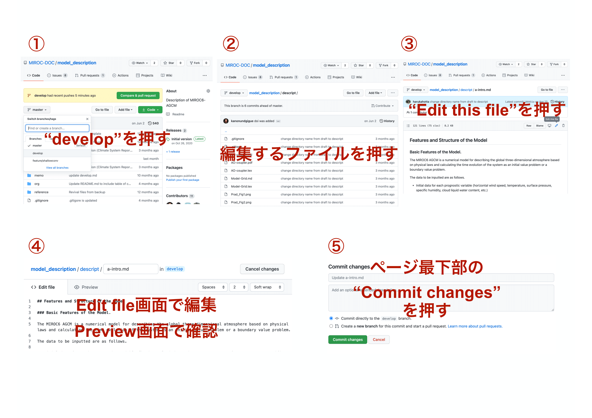

# 開発の手引き

## 目標

- 更新履歴を残す
- ユーザーが現代的な開発手法(git)に慣れる
  - 直接 master ブランチに push しないやり方を学ぶ

## 使用フォーマット

  - 新たに書く原稿は、基本的に Markdown or Latex
  - 形式で迷ったら、[原稿](../descript/)を参照
 

## 使用言語

  - 最終的には英語。日本語で原稿を作成・DeepL Proなどの力を借りて英訳してOK。

## 開発フロー（簡易版）

ブラウザ版GitHubのDevelopブランチを直接編集する。

  - 1)developブランチに移動する。[ここをクリック](https://github.com/MIROC-DOC/model_description/tree/develop)
  - 2)3)4)ファイルを編集する。
  - 5)"Commit changes"を押す。

  
## 開発フロー（詳細版。新しくファイルを作る場合・複数ファイルを編集する場合など）

  - 1)[issue に執筆目標を書く](https://github.com/MIROC-DOC/model_description/issues)
  - 2)ローカルの資料を最新のdevelopに `git pull origin develop`
  - 3)執筆担当の人は issue に基づいて develop ブランチを元に featureE(章の名前など、各自で特徴的な名前を設定) ブランチを作成する(./git.md)`git checkout -b feature develop`。すでにあるリモートブランチを変更する場合、`git checkout -b feature feature`
  - 今いるブランチを確認する。`git branch`
  - 4)feature ブランチで執筆する。
    - a)ファイル変更が一段落するたびに、コミットする
      - コミットするファイルを選択（ステージング）`git add hogehoge`
      - 変更箇所についてコメントと共にコミット`git commit -m "add hogehoge subsection"`
      - コミット状況を確認`git status`
    - b)ローカルのファイル変更をリモートのfeature ブランチへ反映する`git push origin feature`
  - 5)執筆が完了したら[ブラウザ版GitHub](https://github.com/MIROC-DOC/model_description)からdevelopブランチへプル・リクエストを投げる。[やり方](https://docs.github.com/ja/github/collaborating-with-issues-and-pull-requests/creating-a-pull-request#creating-the-pull-request)
  - review が行われ、問題があれば執筆者が再度修正する
    - プルリクエストの一覧は[ここ](https://github.com/pulls)から見れる
  - review で問題が無ければ管理者がマージする
    - コンフリクトが発生している場合、管理者が解消する
  - feature ブランチを削除する。issueをcloseする。

Gitについてはブランチを切る&コミットログを残す、ができれば細かい操作は自由。エディタのGUIを使うと楽。
ローカルのファイル削除などしない限り、Gitの操作は大体取り返しがつく。
